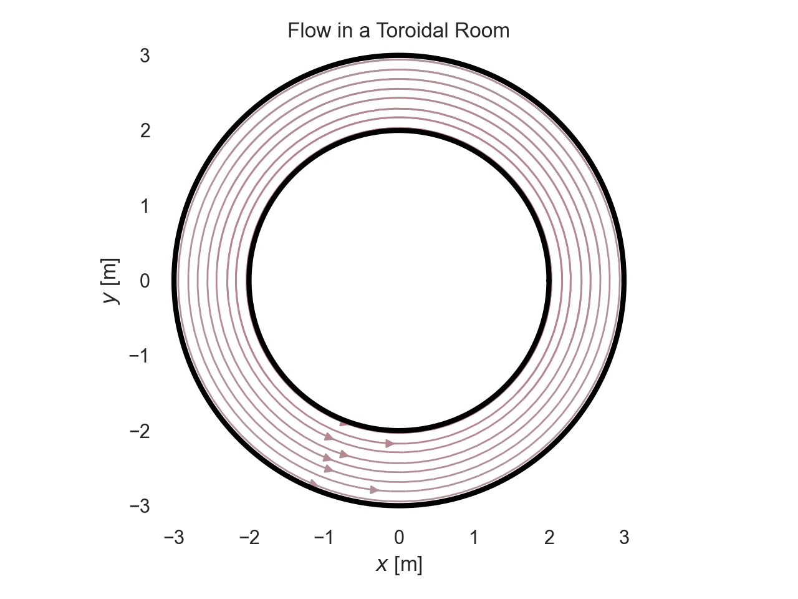
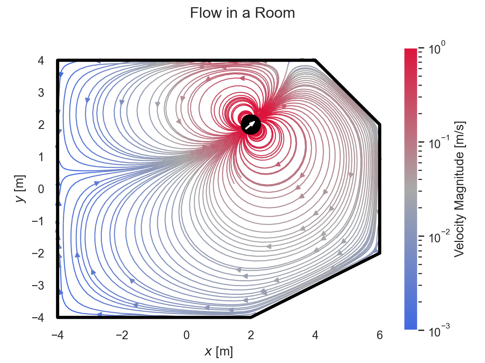
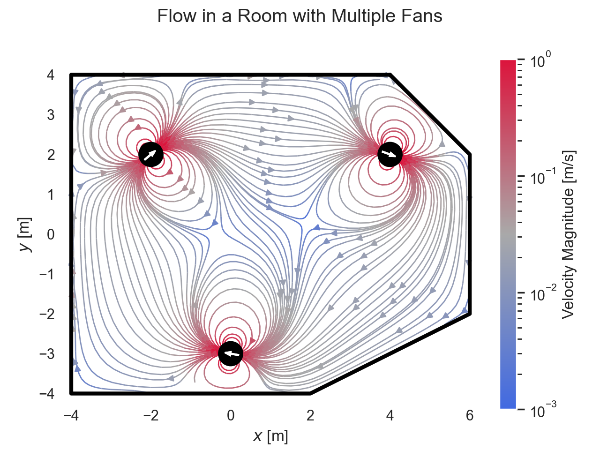
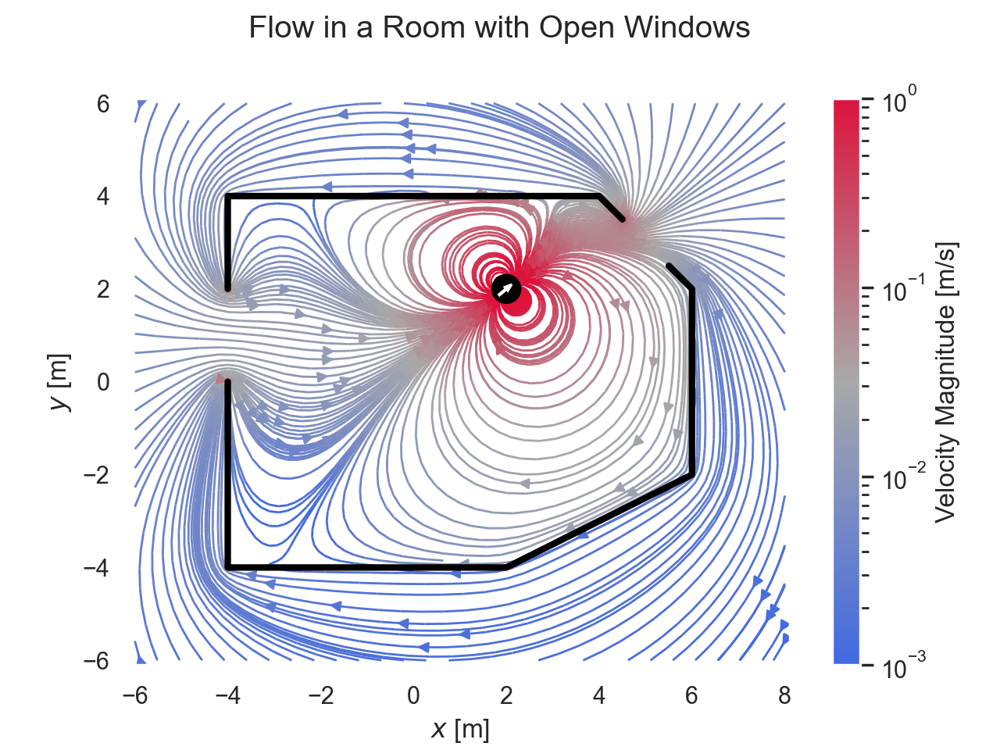

# Viral Room Sim

by Peter Sharpe

-----

Part of an old experiment for using potential flows as fast approximators for flowfield in indoor environments.

## Examples

### Torus

### Room

### Room with Multiple Fans

#### Room with Open Windows

